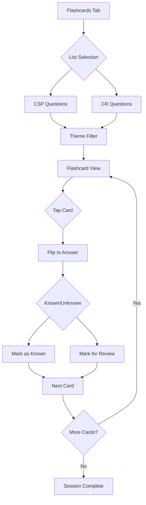

# Flashcards Mode - Technical Implementation Plan

## 1. Feature Overview

**Flashcards Mode** is a quick memorization mode that allows users to review questions in a card-based interface with flip-to-reveal answers, shuffle functionality, and spaced repetition integration.

## 2. User Experience Flow



## 3. Component Architecture

### 3.1 New Components

| Component                                                       | Purpose                                                                      |
| --------------------------------------------------------------- | ---------------------------------------------------------------------------- |
| [`Flashcards.tsx`](src/components/Flashcards.tsx)               | Main container - handles list/theme selection and coordinates sub-components |
| [`FlashcardView.tsx`](src/components/FlashcardView.tsx)         | Individual flashcard with flip animation                                     |
| [`FlashcardControls.tsx`](src/components/FlashcardControls.tsx) | Navigation buttons, shuffle, progress indicator                              |

### 3.2 Component Hierarchy

```
App
└── Flashcards (new)
    ├── List Selection Screen (integrated)
    ├── Theme Filter Bar (integrated)
    └── FlashcardView
        ├── Question Side (front)
        └── Answer Side (back) - shows correct answer highlighted
```

## 4. Data Flow & State Management

### 4.1 Local State (useState)

- `selectedList`: 'csp' | 'cr' | null
- `currentTheme`: number (0 = all themes)
- `currentIndex`: number
- `isFlipped`: boolean
- `isShuffled`: boolean
- `knownCards`: Set<string> (question IDs marked as known this session)
- `sessionOrder`: string[] (ordered question IDs for current session)

### 4.2 Persisted State (useLocalStorage)

- `civique-flashcard-progress`: Record<string, { lastReviewed: string; easeFactor: number; interval: number }>
- Integrates with existing [`useSpacedRepetition`](src/hooks/useSpacedRepetition.ts) hook

### 4.3 Shared Hooks

- [`useSpacedRepetition`](src/hooks/useSpacedRepetition.ts) - existing, integrate for review scheduling
- [`useBookmarks`](src/hooks/useBookmarks.ts) - existing, allow bookmarking from flashcards

## 5. UI/UX Specification

### 5.1 List Selection Screen

- Same as Training component (reuse `selectedList` state pattern)
- Two buttons: CSP and CR lists

### 5.2 Theme Filter Bar

- Horizontal scrollable chips: "All", "Principles", "Institutions", "Rights", "History", "Social", "Daily"
- Same as Training component theme filter

### 5.3 Flashcard View

**Card Design:**

- Centered card container (max-width: 600px)
- Card dimensions: aspect ratio ~3:2
- Border radius: 16px
- Box shadow for depth
- Smooth flip animation (transform: rotateY)

**Front Side (Question):**

- Question number badge (top-left)
- Question text (centered, large font)
- Question type badge (knowledge/situation)
- Theme indicator

**Back Side (Answer):**

- "Answer" label at top
- All options displayed
- Correct answer highlighted with green background
- User's previous answer (if any) shown with indicator

### 5.4 Control Bar

**Navigation:**

- Previous button (left arrow)
- Card counter: "12 / 45"
- Next button (right arrow)

**Actions:**

- Flip button (center, prominent)
- Shuffle toggle
- Bookmark button
- Progress indicator dots

### 5.5 Session Complete Screen

- Summary: cards reviewed, known, needs review
- Option to restart or return to selection
- Integration with spaced repetition (update review dates)

## 6. Translations Required

Add to all locale files (`src/i18n/locales/*.json`):

| Key                   | EN                | FR                       |
| --------------------- | ----------------- | ------------------------ |
| flashcards            | 📇 Flashcards     | 📇 Cartes mémoire        |
| flipCard              | Tap to flip       | Tapoter pour retourner   |
| showAnswer            | Show Answer       | Afficher la réponse      |
| known                 | I know this       | Je connais               |
| reviewAgain           | Review Again      | Réviser                  |
| shuffle               | Shuffle           | Mélanger                 |
| resetShuffle          | Reset Order       | Réinitialiser            |
| sessionComplete       | Session Complete  | Session terminée         |
| cardsReviewed         | Cards Reviewed    | Cartes révisées          |
| markAsKnown           | Mark as Known     | Marquer comme connu      |
| cardsKnown            | Cards Known       | Cartes connues           |
| cardsToReview         | Cards to Review   | Cartes à réviser         |
| restartSession        | Restart           | Recommencer              |
| backToSelection       | Back to Selection | Retour à la sélection    |
| smartReviewFlashcards | 🎯 Smart Review   | 🎯 Révision intelligente |

## 7. Implementation Steps

### Step 1: Add Translations

- Update all 7 locale files with new flashcard-related strings

### Step 2: Update Types

- Add `"flashcards"` to the [`Tab`](src/types/index.ts) type union

### Step 3: Create Flashcards Component

- [`src/components/Flashcards.tsx`](src/components/Flashcards.tsx)
- List selection UI (reused from Training)
- Theme filter bar (reused from Training)
- Flashcard display and navigation

### Step 4: Create Flashcard View Sub-component

- [`src/components/FlashcardView.tsx`](src/components/FlashcardView.tsx)
- Flip animation with CSS
- Question and answer display

### Step 5: Update App.tsx

- Import Flashcards component
- Add navigation tab
- Add conditional rendering for flashcards tab

### Step 6: Add CSS Styles

- Flashcard flip animation
- Card styling
- Responsive adjustments
- Dark mode support

### Step 7: Integrate Spaced Repetition

- Update [`useSpacedRepetition`](src/hooks/useSpacedRepetition.ts) integration
- Track known/unknown responses
- Schedule review based on performance

## 8. CSS Animation Specification

```css
/* Flashcard flip animation */
.flashcard {
  perspective: 1000px;
}

.flashcard-inner {
  transition: transform 0.6s;
  transform-style: preserve-3d;
}

.flashcard-inner.flipped {
  transform: rotateY(180deg);
}

.flashcard-front,
.flashcard-back {
  backface-visibility: hidden;
}

.flashcard-back {
  transform: rotateY(180deg);
}
```

## 9. Acceptance Criteria

1. ✅ User can select CSP or CR question list
2. ✅ User can filter by theme
3. ✅ Cards display question on front, answer on back
4. ✅ Tapping card flips to reveal answer
5. ✅ User can navigate between cards with buttons
6. ✅ Shuffle button randomizes card order
7. ✅ "Known" button marks card and advances to next
8. ✅ "Review Again" button marks for spaced repetition review
9. ✅ Progress indicator shows current position
10. ✅ Session summary displays on completion
11. ✅ Dark mode fully supported
12. ✅ RTL language support (Arabic)
13. ✅ Mobile-responsive design

## 10. File Changes Summary

| File                               | Action                         |
| ---------------------------------- | ------------------------------ |
| `src/types/index.ts`               | Add "flashcards" to Tab type   |
| `src/i18n/locales/*.json`          | Add translations (7 files)     |
| `src/components/Flashcards.tsx`    | Create new component           |
| `src/components/FlashcardView.tsx` | Create new component           |
| `src/App.tsx`                      | Add Flashcards tab and routing |
| `src/App.css`                      | Add flashcard styles           |
